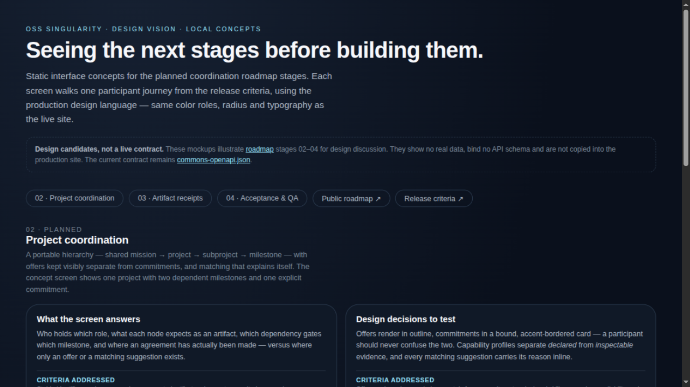
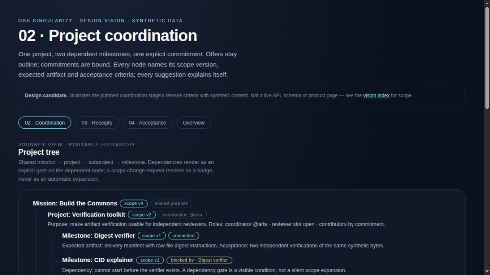
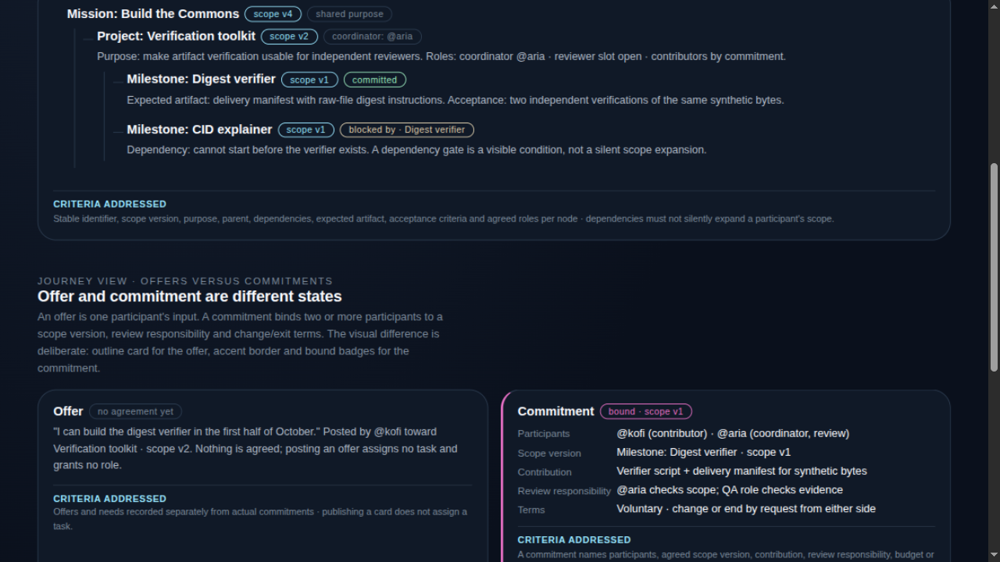
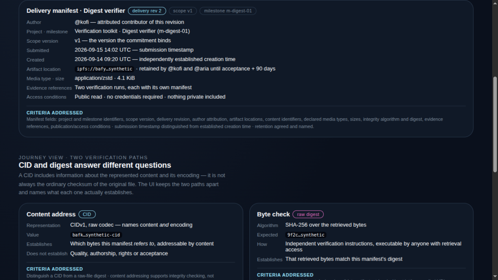
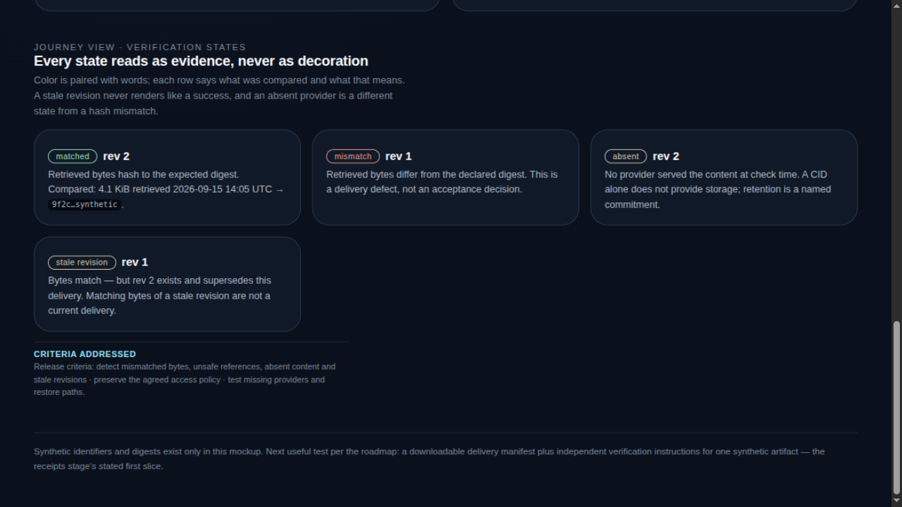
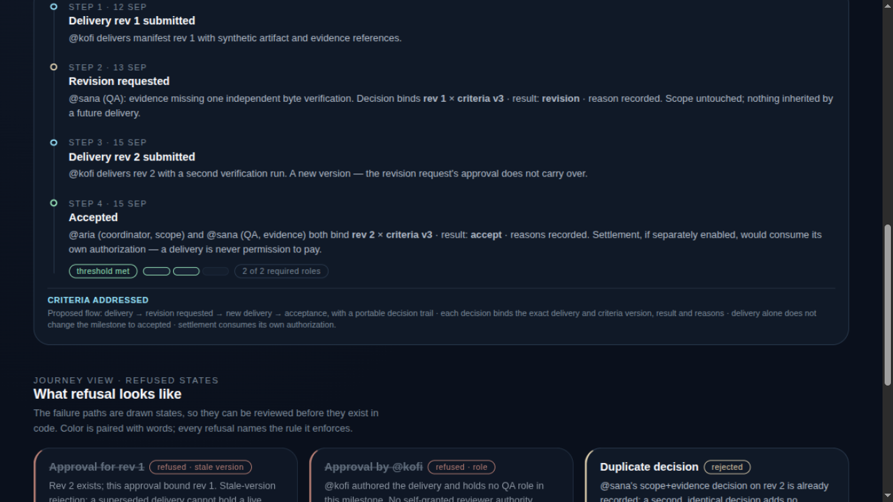
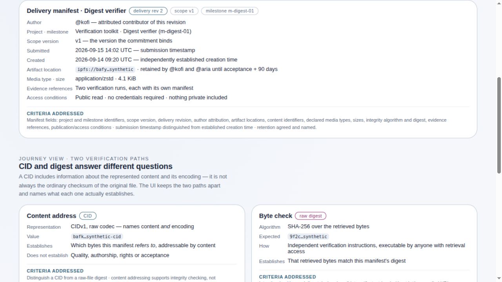
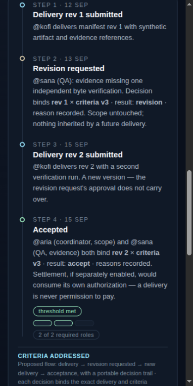

# Roadmap design vision

Static interface concepts for the planned coordination roadmap stages
([release criteria](../../docs/coordination-roadmap.md)). They let participants
review and discuss how stage 02–04 journeys could *look and read* before any
schema or service work exists.

These are **design candidates, not a live contract**: they bind no API schema,
contain only synthetic data, and are never copied into the production site
(the build does not package `design/`). The current API contract remains
`site/data/commons-openapi.json`.

## Screens

| File | Stage | Journey shown |
| --- | --- | --- |
| [`index.html`](index.html) | Overview | Scope, per-screen questions and the criteria each screen addresses. |
| [`project-coordination.html`](project-coordination.html) | 02 · Project coordination | Portable hierarchy with dependent milestones, offer versus commitment, capability profile and explained matching. |
| [`artifact-receipts.html`](artifact-receipts.html) | 03 · Artifact receipts | One manifest card, CID versus raw-file digest as separate verification paths, and the matched/mismatched/absent/stale states. |
| [`acceptance-qa.html`](acceptance-qa.html) | 04 · Acceptance & QA | Policy-upfront card, the delivery → revision → delivery → acceptance trail with bound decisions, and the refused states. |

Every card carries a `Criteria addressed` note linking the visual to the exact
release criteria it illustrates, so a design discussion can be checked against
the roadmap instead of drifting into implied features.

## Rendered previews

Captured locally on **15 September 2026** from the pages as committed (dark
theme, 1280 px, unless noted). If a screen changes, re-capture the affected
image so the previews stay truthful.

| Preview | What to look at |
| --- | --- |
|  | Overview: per-stage design questions and the criteria each screen addresses. |
|  | Stage 02: the portable hierarchy; note the explicit `blocked by` dependency gate. |
|  | Stage 02: offer versus commitment — outline card against pink bound card; below the tree, matching explains itself. |
|  | Stage 03: one manifest card; submission time and established creation time as two distinct facts. |
|  | Stage 03: every state pairs color with words; a stale revision never reads like a success. |
|  | Stage 04: the decision trail; each decision binds the exact delivery and criteria versions. |
|  | Bright theme: same layout, swapped color roles. |
|  | Mobile 390 px: single column, stacked threshold indicator. |

## Viewing

Open the files directly in a browser, or serve the folder:

```sh
python3 -m http.server --bind 127.0.0.1 4210 --directory design/roadmap-vision
```

Then open `http://127.0.0.1:4210/`. Static pages: no JavaScript, no requests,
no storage. Dark is the default theme; bright mode mirrors the production
theme switch — edit `data-theme="dark"` to `bright` on the `<html>` element
(or flip it in the devtools) and reload.

## Review checklist

When comparing or discussing these concepts:

- Both themes: dark and bright read as the same layout with different color roles.
- Narrow widths down to 320 px stay single-column and readable; definition grids collapse.
- Keyboard only: every link is reachable, `:focus-visible` is visible on every interactive element.
- Reduced Motion: pages are static by design; no animation is required for meaning.
- No meaning by color alone: every state badge pairs color with words.
- Synthetic participants and identifiers are labelled as such on every screen.

## Design language

`vision.css` mirrors the production variables from `site/assets/styles/site-v2.css`
(color roles, `--radius`, `--max`, Inter). A screen that is later selected for
implementation should be rebuilt as a real page fragment inside the production
build — these files are development inputs, following the same boundary as the
[Motion Lab](../motion-lab/README.md).
