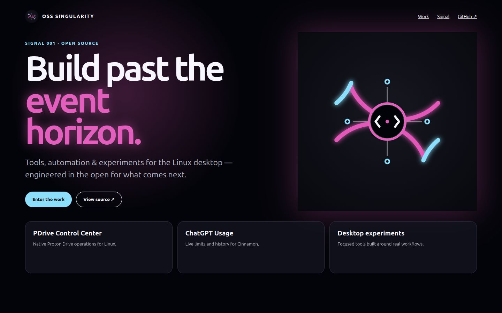
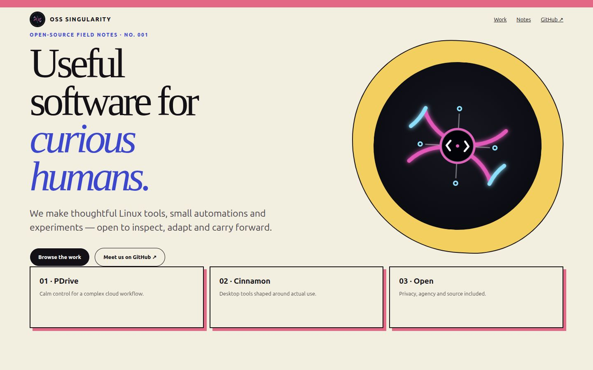
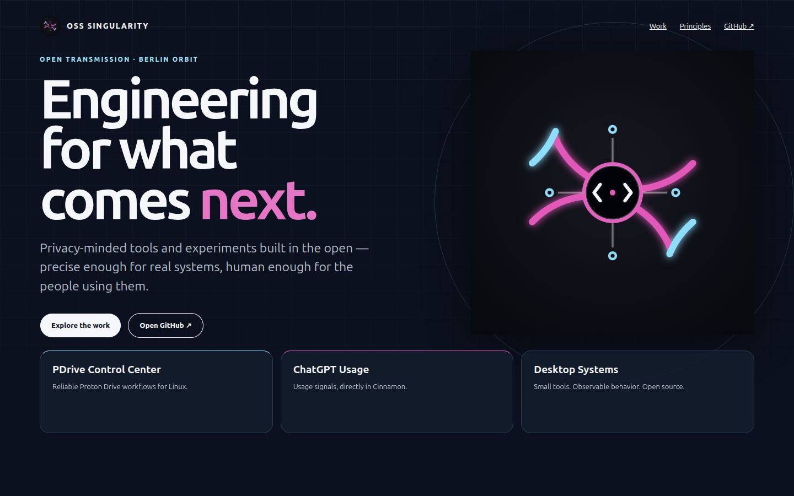

# Visual directions

Three deliberately different directions were prepared from the same authentic inputs: the canonical vector avatar, the public organization voice, and real project interfaces. The direction is selected by product fit rather than novelty alone.

## A. Event Horizon

A dramatic black field, luminous magenta/cyan orbit, oversized mission statement, and dense terminal-like metadata. This is the most immediate interpretation of “beyond the event horizon.” It has excellent memorability and natural continuity with the avatar, but the strongest neon treatment can overpower product screenshots and drift toward familiar cyberpunk conventions.

## B. Prismatic Field Notes

A warm, almost-paper canvas with black editorial typography, sharp cobalt and coral annotations, and the avatar used as a stamp rather than a scene. This makes the organization unusually human and readable for a technical brand. It is distinctive, but the light editorial mood weakens the connection to the existing dark product interfaces and cosmic identity.

## C. Signal Observatory

A deep-space blue observatory with restrained cyan and magenta signals, precise grid lines, warm copy, and product work presented as received transmissions. It keeps the cosmic anchor without turning every surface into neon, gives real screenshots the visual priority, and supports both technical credibility and an inviting voice.

## Selection criteria

| Criterion | Event Horizon | Prismatic Field Notes | Signal Observatory |
| --- | ---: | ---: | ---: |
| Authenticity to current identity | 5 | 3 | 5 |
| Product screenshot legibility | 3 | 4 | 5 |
| Technical credibility | 4 | 4 | 5 |
| Human warmth | 3 | 5 | 4 |
| Distinctiveness without cliché | 3 | 5 | 5 |
| Responsive resilience | 4 | 5 | 5 |
| **Total** | **22** | **26** | **29** |

## Selected direction

**Signal Observatory** is selected for Launch Pad v0. It preserves the avatar’s event-horizon geometry and color signals while giving the actual tools room to prove the mission. The implementation borrows the field-notes direction’s conversational warmth and editorial spacing, but not its light palette. Event Horizon remains useful as a future campaign or release-art direction rather than the permanent shell.

The prototypes live in `design/prototypes/`; they are design evidence and are never copied into production.
