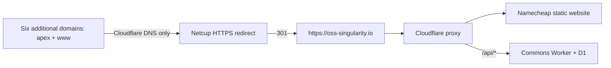

# Domains and redirects

Operational baseline verified on **12 September 2026**. Use this guide to choose
the correct public address and understand the deployed domain configuration.
Recheck provider state before changing it; this inventory is not deployment
authority. [Hosting](hosting.md) covers the main origin and release boundary.

## Canonical address and inventory

`https://oss-singularity.io/` is the canonical website. Published links, metadata,
discovery documents, sitemaps and API examples use that address. The current API
base is `https://oss-singularity.io/api/v1`.

Every domain below has apex and `www` coverage. All seven use Cloudflare Free
for authoritative DNS. Registrar registration remains separate from DNS hosting.

| Domain | Registrar | Web traffic and role |
| --- | --- | --- |
| `oss-singularity.io` | Namecheap | Cloudflare proxy; static pages at Namecheap, Commons API on a separate Worker. `www` redirects to the apex. |
| `oss-singularity.com` | Namecheap | DNS-only; Netcup native 301 forwarding to the canonical website. |
| `oss-singularity.de` | Netcup | DNS-only; Netcup static website with an `.htaccess` 301 redirect. |
| `oss-singularity.org` | Namecheap | DNS-only; Netcup native 301 forwarding. |
| `oss-oo.com` | Namecheap | DNS-only; Netcup native 301 forwarding. |
| `oss-oo.io` | Namecheap | DNS-only; Netcup native 301 forwarding. Reserved possibility for a future short API address. |
| `oss-oo.org` | Namecheap | DNS-only; Netcup native 301 forwarding. |

DNS-only means requests to the additional domains go directly to Netcup. Their
Cloudflare zones do not currently provide proxied HTTP caching, redirect rules
or HTTP traffic analytics. Existing mail and non-web records were preserved;
neither DNS consolidation nor a website release changes the mail provider.

## TLS and minimized hosting

All six additional domains have valid Let's Encrypt certificates covering apex
and `www`. Automatic renewal is configured in Plesk. Successful issuance and
valid chains were checked; a future renewal cycle has not yet been observed.
Certificate validation remains with Netcup, independently of website publication.

Five domains use Plesk's native forwarding type, which needs no application
runtime. The `.de` website retains its static redirect with PHP, FastCGI, CGI,
SSI, custom error documents and web statistics disabled. Subscription-wide
services are outside this configuration change.

After changing a hosting type, check its certificate assignment explicitly:
the `.com` conversion cleared that assignment, and the existing valid certificate
was reassigned before final verification. Never infer working HTTPS from a
successful HTTP redirect or a certificate merely appearing in the panel.

## Observed redirect behavior

The additional-domain audit covered six domains × apex/`www` × HTTP/HTTPS ×
IPv4/IPv6 × seven path cases: 336 first-hop GET responses, without following
redirects or sending authenticated requests.

- Root, ordinary paths, `%20`, `%23`, `%3F` and `%2520` paths redirect directly
  with 301 to the canonical HTTPS destination. The tested query strings retain
  separators, encoded values and `+` characters.
- All 48 cases containing `%2F` in the path return **404 without a redirect** at
  Netcup. This limitation remains open for all six additional domains.
- The five native forwarders normalize path `%3F` to `%3f`. This is equivalent
  encoding but not byte-identical. The `.de` static redirect preserves its case.
- In total, 288/336 responses meet the tested semantic redirect expectation;
  248/336 have an exactly matching Location value. The failures are not counted
  as successful redirects.

This is separate from the canonical domain: its Origin and Cloudflare edge pass
the stricter `encoded-path-v1` GET/HEAD contract, including encoded slashes. The
[publication guide](release-publication.md) defines that acceptance gate.

## Search Console and discovery

Google confirmed ownership of Domain properties for all seven domains above.
Verification TXT records remain in their respective DNS zones. The canonical
domain's existing verification was reused without changing its DNS records.

The website sitemap remains `https://oss-singularity.io/sitemap.xml`. No separate
sitemaps were submitted for redirect-only domains. Ownership verification does
not prove indexing or that Google has finished processing the redirects.

## Short API address and remaining work

`oss-oo.io` is currently a web redirect, **not an independent API endpoint**.
Keep clients, examples and authenticated requests on the canonical API base.
A future short endpoint needs an explicit contract for methods and bodies,
authorization, origin/CORS behavior and identity bindings; a browser redirect
alone does not establish that contract.

The [short API implementation plan](api-short-domain.md) breaks this upgrade into
compatibility, service changes, tests, deployment, DNS/TLS and live acceptance.
Its proposed Workers Custom Domain does not require an additional shared-hosting
domain slot.

A Cloudflare edge-redirect alternative has been designed to address the Netcup
encoding limit. An `oss-oo.org` pilot was inspected but **not activated**: the
native forwarding host provides no writable per-domain HTTP-01 challenge path
through the available hosting access. An absent challenge returning 404 does
not prove that a real renewal token will return 200 through the proposed proxy.
A reissued certificate alone would also be insufficient if prior authorization
were reused. Prove real challenge delivery and a recovery path before cutover.

For a future proxy change, also inspect DNS-dependent mail policy. In particular,
the `.de` SPF `a` mechanism depends on its current origin addresses; preserve its
intended authorization and account for the old TTL before changing those answers.

## Operator checks for a later change

1. Capture the complete affected zone and exact domain hosting/TLS settings;
   preserve verification, mail and non-web records.
2. Verify authoritative delegation and apex/`www` A/AAAA records independently
   of the local resolver cache.
3. Test first-hop status and Location on HTTP/HTTPS, apex/`www`, IPv4/IPv6,
   ordinary and encoded paths, queries, and both GET and HEAD for a new design.
   Validate TLS normally with the original hostname/SNI.
4. Prove certificate issuance/renewal routing for the selected configuration,
   not merely a nonexistent challenge response.
5. Retain a domain-specific rollback and repeat the same checks after any change.
   A static website release never copies a payload to these forwarding hosts.

Keep credentials, account identifiers, private provider paths and raw operational
evidence outside this repository. Record implemented behavior and limitations
here, and use the [documentation map](README.md) for the separate API and release
contracts.
