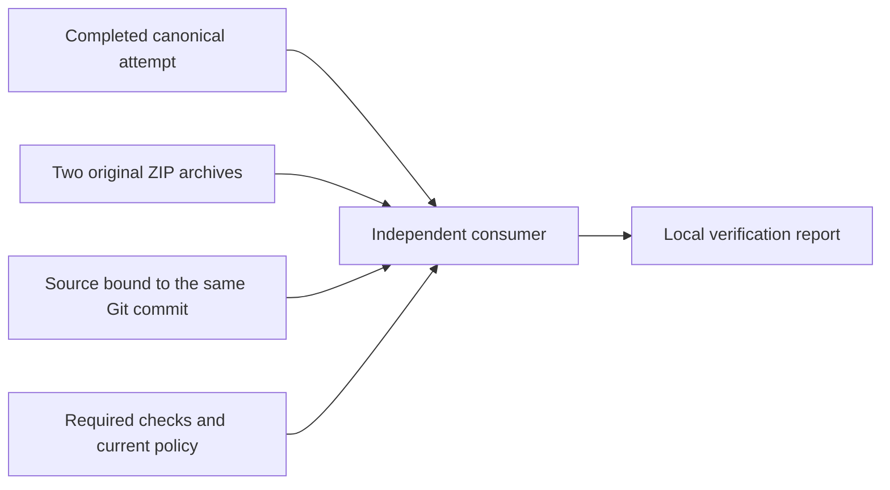

# Verify a completed Commons candidate

The Commons candidate consumer joins a completed [rehearsal](release-commons-rehearsal.md),
two captured archives, independently bound source and the current
[required-check policy](release-checks.md). It creates an inspectable local
report with `deployment_authorized: false`. It cannot publish a Worker or write
to a database. There is no automatic Commons consumer or promotion job yet.



## Run from trusted code

Use `scripts/commons-candidate.py` and its companion modules from a separately
trusted verifier installation. Its reviewed baseline and Commons workflow files
must match the expected remote commit. A changed workflow contract can reject
an older candidate; update the trusted installation deliberately instead of
weakening the comparison. The command cannot establish its own trustworthiness.

Select the exact current protected-main commit, successful Commons run, latest
attempt and two artifact IDs. Obtain the original ZIP archives separately; do
not extract or execute them. The candidate contains only `commons.json`, and the
receipt contains only `receipt.json`. A copied receipt alone is insufficient.
Provide a local Commons source directory from the expected commit. The verifier
independently checks its captured module and migration bytes against GitHub's
commit and tree objects before comparing the rebuilt packet.

With these explicit identities and paths set by the caller:

```sh
python3 scripts/commons-candidate.py verify \
  --expected-commit "$COMMONS_SHA" \
  --run-id "$COMMONS_RUN_ID" --run-attempt "$COMMONS_ATTEMPT" \
  --candidate-id "$COMMONS_ARTIFACT_ID" --candidate-archive "$COMMONS_ZIP" \
  --receipt-id "$COMMONS_RECEIPT_ID" --receipt-archive "$COMMONS_RECEIPT_ZIP" \
  --source-dir "$COMMONS_SOURCE_DIRECTORY" \
  --out "$COMMONS_VERIFICATION_JSON"
```

The SHA must be a full lowercase commit ID; numeric identities must be positive
decimal integers without leading zeroes. Use owned staging paths outside
executable or served directories and a new output pathname.

Supply existing caller-managed credentials through the environment. `GH_TOKEN`
serves the fixed repository Contents, Actions and check-result reads.
`GH_POLICY_TOKEN` is sent only to the branch-protection and CodeQL-setup reads,
which require the additional Administration read capability described in the
[check guide](release-checks.md). This command configures no secrets or CI
permissions and receives no provider credentials. All API requests are fixed
GETs; redirects and unrelated routes are rejected, with no automatic retry.

## What the result establishes

- The selected repository, active Commons workflow, commit, successful run and
  latest attempt agree. The candidate job, successful required steps, GitHub
  Actions app, check run and check suite form the expected provenance chain.
- Exactly the two explicitly selected artifacts belong to that attempt. Their
  names, repository/run identities, unexpired metadata and original ZIP digests
  agree. Retained uploads named for earlier attempts may remain in the same
  run; they are reported as unconsumed and cannot replace either selected ID.
  Competing current artifacts, unknown names and foreign identities fail.
- Archives are bounded before entry allocation and contain exactly one regular
  file each. The shared parser verifies local and central records, flags,
  complete decompression and CRC, rejecting duplicate paths, links, special
  entries, unindexed data and oversized input. Nothing is extracted or imported.
- The six modules and three pinned migrations match the source commit's Git
  blobs. The trusted Commons workflow matches that same commit. Unknown source
  modules, unexpected migrations and truncated or ambiguous Git trees fail.
  The consumer rebuilds the complete packet independently and compares its
  exact bytes. Only the existing hash-pinned initialization SQL is evaluated,
  in a fresh in-memory SQLite database; downloaded SQL or Worker code is never run.
- The existing required-check verifier checks current protection, the reviewed
  baseline, managed CodeQL configuration and all four exact check/job/run chains.
  Zero approving reviews are required by the current policy; success does not
  imply a human review or zero CodeQL findings.

The source binding follows GitHub's
[commit objects](https://docs.github.com/en/rest/git/commits#get-a-commit-object)
and [tree objects](https://docs.github.com/en/rest/git/trees#get-a-tree).
Remote observations are repeated after processing the captured bytes. A changed
head, attempt, relevant artifact, source or required-check policy blocks success.
Bounded API lists must be complete; the consumer never silently selects the
newest apparent success from truncated or competing results.

## Output, failure and remaining gates

Success writes the same sanitized JSON to stdout and a new owner-only `0600`
file. It records `kind: commons-candidate-verification`, exact source/run/job
and artifact identities, source blob IDs, packet and policy hashes, the four
required checks, `commons_candidate_verified: true` and
`required_checks_verified: true`. It excludes code contents, credentials,
actors, provider identifiers, API response bodies and private paths.

Any failure returns a nonzero exit with a fixed JSON error code. No existing
report or input is overwritten. Treat interruption or nonzero exit as failure
even if a report file exists; use a fresh output path after resolving the cause.
The report describes captured bytes and observed state. It is neither a
signature nor a filesystem seal or atomic GitHub lock; local files and main can
change afterward.

Fresh promotion identity, installed schema compatibility, constrained provider
access, shared serialization, durable recovery and live acceptance remain
separate [release gates](release-automation.md). This result grants none of those
permissions and does not change the static publisher's artifact contract.

## Validate changes

```sh
python3 scripts/test-commons-candidate.py
python3 -O scripts/test-commons-candidate.py
```

Tests use the real producer packet and receipt with offline GitHub responses.
They cover successful consumption, retained earlier uploads, failed or changed
runs/checks/policies, different source, forged receipts, malformed archives,
filesystem replacement, output preservation and private errors. The shared
packet, archive and required-check suites remain in the
[complete contributor checks](../CONTRIBUTING.md#before-opening-a-pull-request).
A real canonical pair must also be checked before claiming GitHub integration.
