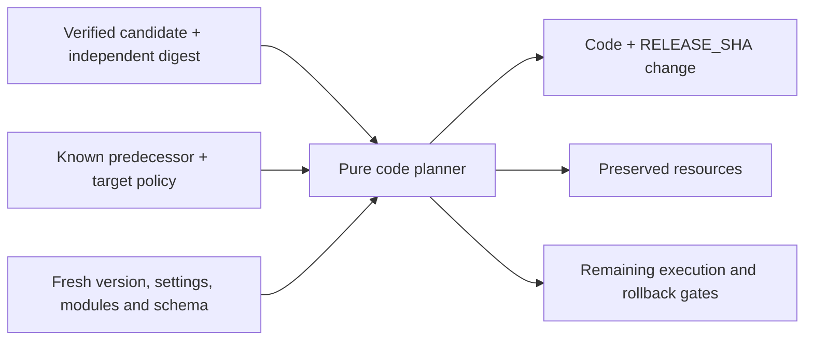

# Plan a Commons code transition

[`commons_plan.py`](../scripts/commons_plan.py) calculates a deterministic,
version-bound plan from captured inputs. It checks candidate and predecessor
packets, an independently recorded baseline and a fresh normalized observation.
It performs no filesystem, network, SQL or Worker operations. The result always
has `plan_only: true` and `deployment_authorized: false`.



The [completed-run consumer](release-commons-candidates.md) establishes source,
artifact and check provenance. The planner does not repeat that remote check or
trust a `verified: true` flag in supplied JSON. Its expected commit and packet
digest must come from a trusted caller's verified capture. Automatic Commons
promotion and a constrained provider adapter are still separate work.

## Inputs and trust boundary

Call `build_plan` in trusted Python code with these keyword arguments:

| Argument | Required meaning |
| --- | --- |
| `candidate_packet` | Exact bounded bytes accepted by the candidate consumer. |
| `expected_candidate_commit` | Independently selected full lowercase Git commit. |
| `expected_candidate_packet_sha256` | Independently verified digest of those exact packet bytes. |
| `predecessor_packet` | Retained known code packet for the installed release, checked without executing historical code. |
| `baseline` | Independently recorded predecessor identity, generation and hashes. |
| `observation` | Fresh, complete normalized target metadata, module hashes and schema definitions. |
| `target_policy` | Independently configured target identities, never selected by the candidate. |

The planner's schema version and target are `1` and `oss-commons`. The target
policy contains `account_id`, `zone_id`, `script_name`, `database_id` and
`route_id`. Profile 1 accepts only the named Commons script and its established
configuration. Provider identifiers belong in private operator configuration,
not in the repository, CI artifacts or this guide.

The baseline contains `generation`, `commit`, `packet_sha256`, `policy_sha256`,
`observation_sha256`, `version_id` and `deployment_id`, plus the schema version
and target. Hashes use the shared canonical JSON encoder. The observation hash
covers the normalized state returned by `observed_state`: schema definitions
are replaced with their validated profile and fingerprint. Independently
bootstrap this checkpoint once; never recalculate a baseline from an unexpected
fresh state to make a failing promotion pass. A baseline hash is an integrity
binding, not a signature or proof of its origin.

The normalized observation contains the schema version, target, account, zone
and script identities, plus:

- `deployment`: ID, strategy and the complete active version/percentage list.
- `version`: active ID, script etag, binding map and runtime metadata.
- `latest_version_id`: independently observed latest uploaded version.
- `settings`: complete normalized script settings, including bindings.
- `routes`, `schedules` and `subdomain`: the complete in-scope routing and trigger state.
- `modules`: the exact six names with independently captured sizes and hashes.
- `schema`: the bounded `type`, `name`, `tbl_name`, `sql` definitions used by the
  [schema fingerprint](release-commons-artifacts.md), without application rows.

[`test-commons-plan.py`](../scripts/test-commons-plan.py) contains a complete
synthetic example of this contract. Binding maps use the binding name as key;
secret entries contain only `type: secret_text`. The observer must validate
provider responses before normalizing them, reject unknown resource/settings
fields, establish list completeness and detect observation races. It may omit
reviewed non-operative provider fields such as actor labels or timestamps.
Dropping an unknown binding or an unrecognized setting is not normalization.
The planner cannot determine whether a caller omitted something before the call.

## What passes and what fails

Both packets are revalidated against the existing six-module, runtime and
schema profile. The candidate's exact digest must match its independent pin;
the predecessor must match the retained baseline. A reused release commit is
rejected. A new commit with identical code is represented truthfully as six
`keep` operations and a release-identity change.

The observed installation must match the predecessor bytes and baseline hash.
Exactly one known version must serve 100 percent of traffic, and it must also
be the latest upload. A separate pending version, changed deployment, etag drift
or partial rollout blocks planning. The active version's binding and runtime
metadata must agree with script settings.

Profile 1 preserves the D1 target, two opaque secret references, public origin,
compatibility date/flags, standard usage model, disabled logging/observability,
placement, tags and tail consumers. It also pins the API route, hourly cron and
disabled workers.dev/preview endpoints. Additional bindings, routes, runtime
limits, changed triggers and unknown fields fail rather than being silently
discarded. Changing this profile requires a separately reviewed contract.

Only module bytes and `RELEASE_SHA` may differ in the desired version. The
planner fingerprints observed schema definitions without running their SQL.
Matching DDL establishes structural agreement; it does not prove that candidate
or predecessor code remains compatible with current data or API clients.

## Output and future execution

The plan contains the input bindings, candidate and predecessor descriptors,
module changes, desired version, preserved configuration and a `plan_sha256`.
It returns a separate object graph and leaves its inputs unchanged. Inputs have
bounded size, depth and types; validation also runs with Python optimization
enabled. The result contains provider identities and belongs in private
operator storage. It contains no code bodies, secret values or application rows.

Code and the release-identity binding must activate together. A future adapter
must verify and durably record the newly staged version before activation;
therefore `activation.staged_version_id` is intentionally `null`. The plan is
not an upload or deployment request and contains no invented provider version ID.
Cloudflare separates [versions and deployments](https://developers.cloudflare.com/workers/versions-and-deployments/);
its [version details](https://developers.cloudflare.com/api/resources/workers/subresources/scripts/subresources/versions/methods/get/)
expose version resources that an adapter must verify.

The rollback section names the known predecessor version and requires a durable
forward receipt for the same attempt, a fresh match to the candidate and
preserved state, and compatibility with the current schema and data. It never
proposes database restoration. Cloudflare's [rollback guidance](https://developers.cloudflare.com/workers/versions-and-deployments/rollbacks/)
also distinguishes a previous Worker version from changes to connected data.
Secret names alone cannot prove preservation of secret values; that remains a
separate provider gate.

Next, a transition fixture must bind this plan to an attempt and durable journal,
model upload/activation/rollback, and exercise interruptions and competing
writers. A scoped observer and adapter must then establish fresh complete reads,
opaque-secret preservation and verified provider outcomes. No provider lock,
compare-and-swap or retry guarantee follows from this local plan. Unknown upload
or deployment outcomes require reconciliation before further writes. All
[remaining release gates](release-automation.md) still apply.

## Validate changes

```sh
python3 scripts/test-commons-plan.py
python3 -O scripts/test-commons-plan.py
```

The tests use real producer packets with synthetic provider state. They cover
exact changes, preservation, deterministic hashes, malformed/oversized inputs,
foreign targets, forged predecessors, partial deployments, pending versions,
runtime/schema/module drift and rollback limitations. I/O, subprocess, network
and database entry points are blocked during the purity test. A read-only real
target capture is useful integration evidence, but does not demonstrate a
successful upload, activation or rollback.
