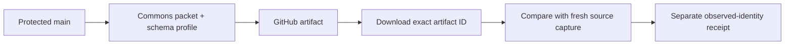

# Commons release rehearsal

The [Commons rehearsal workflow](../.github/workflows/commons-release-rehearsal.yml)
packages the six production modules, uploads the packet, downloads that exact
artifact ID and checks its bytes against a fresh source capture. It records the
observed GitHub artifact identity in a separate receipt. This is a preparation
stage for Worker releases; it cannot publish code or modify a database.

The static rehearsal remains a separate workflow with its existing two-artifact
contract. A Commons packet is never passed to the static publisher.

## How it runs



Only a push to `main` in the canonical repository can run the workflow. The
workflow and helper both check repository identity, event, branch, protection,
checkout commit and workflow-source commit. The helper reads the current
protected `main` before building and again before recording the receipt; a newer
commit stops the stale rehearsal.

The workflow uses only the built-in token with Contents read and Actions read.
It has no production environment, provider credentials or deployment permission.
Actions are pinned to reviewed commit SHAs, and checkout does not persist Git
credentials. The shared helper permits only GET requests to canonical `main`
and one explicitly identified repository artifact; it refuses redirects and
unrelated routes.

The [Commons artifact contract](release-commons-artifacts.md) fixes the six
modules, runtime requirements and existing schema profile. The workflow pins
profile 1's expected fingerprint independently of the packet. No downloaded
module or migration SQL is executed. The source check evaluates only the
existing hash-pinned initialization files in a fresh in-memory SQLite database.

## Artifacts and receipt

Each attempt retains two separate GitHub artifacts for seven days:

| Artifact name | Contents |
| --- | --- |
| `commons-candidate-<commit>-<run>-<attempt>` | One `commons.json` code packet. |
| `commons-rehearsal-receipt-<commit>-<run>-<attempt>` | One `receipt.json` with observed identity and remaining gates. |

The packet upload is followed by a download using its returned artifact ID with
digest mismatch configured as an error. Receipt generation reopens that packet,
checks every module against independently captured source, and reads the
artifact's metadata through GitHub's API. It verifies ID, name, archive digest,
expiry, run, canonical repository, branch and commit. The artifact name also
binds the attempt; an artifact from a previous attempt is rejected.

The receipt records the packet SHA-256, constrained descriptor, observed
protected head and artifact ID/digest. It contains no module contents, token,
private path or provider identifier. It is written exclusively as a new file;
an existing receipt cannot be overwritten.

## What success does and does not establish

The receipt is produced before its workflow can finish, so it explicitly leaves
`successful-github-run`, `required-github-checks` and
`trusted-provenance-consumption` pending. Its `deployment_authorized` value is
always `false`. A green rehearsal or a self-consistent downloaded receipt is
not release authorization.

The next consumer must independently observe the completed successful canonical
attempt and required checks, authenticate both artifact identities and archive
bytes, validate their exact layouts and compare the packet with trusted source.
It must not copy the expected identity or schema from an untrusted receipt.
Fresh protected-head and installed-schema checks, constrained provider access,
serialization, durable recovery and live acceptance remain required before
Worker promotion. This rehearsal has no production database access and cannot
establish current live schema compatibility.

See [Release automation](release-automation.md) for the remaining stages.

## Validate changes

Run from the repository root:

```sh
python3 scripts/test-commons-rehearsal.py
python3 -O scripts/test-commons-rehearsal.py
```

These tests use real Commons packets and synthetic GitHub responses. They reject
forks, other workflows, stale or unprotected heads, earlier attempts, expired or
replaced artifacts, changed module bytes and schema, changed local source,
unrelated API routes and attempts to overwrite receipts. CLI failure checks
verify that unexpected exception text remains private. The shared transport and
packet tools have their own rejection suites in the
[complete contributor checks](../CONTRIBUTING.md#before-opening-a-pull-request).
The first canonical run must additionally demonstrate the real upload/download
round trip; offline fixtures alone cannot establish that evidence.
