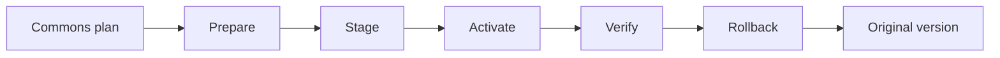

# Commons code transition fixture

[`commons_transition.py`](../scripts/commons_transition.py) is a pure decision engine
for exactly one version-bound Commons code transition. It has no I/O, network, clock,
UUID, SQL or Worker code execution. [`commons_fixture.py`](../scripts/commons_fixture.py)
provides a private, self-created fixture with a synthetic provider backend.
Together they implement the Prepare → Stage → Activate → Verify → Rollback
lifecycle for an offline testable code deployment.



Every effect has a durable intent before dispatch and an independently observed
beleg after. Lost replies are classified as `applied`, `not_applied_final`,
`unknown` or `conflict` without retrying or mutating. The fixture uses separate
atomically replaced files for the control journal and simulated provider state,
so a crash after a provider effect but before the control beleg is a deliberate
recovery test.

## Architecture

### Pure decision engine (`commons_transition.py`)

- **`OperationKey`**: Frozen dataclass (operation_id, plan_sha256, start_generation).
  Held externally; never deserialized from a candidate.
- **`FixtureDecision`**: Frozen dataclass from the trusted harness. Direction,
  identity, observation hash, schema fingerprint and data revision.
- **`validate_state(state, operation_key)`**: Full structural validation.
- **`classify_observation(plan, phase, receipts, observation, opaque_evidence)`**:
  Classifies the current observed state against the expected plan.
- **`decide(state, command, observation, operation_evidence)`**: Pure decision
  function. Returns `(new_state, intent_or_None)` for every command.

### Fixture runner (`commons_fixture.py`)

- **`Handle`**: Trusted, frozen handle with container path, nonce, anchors and
  lock identity. Never deserialized.
- **`create_fixture(initial_capture, trusted_baseline, target_policy, opaque_refs)`**:
  Context manager that creates a temporary directory with `control/`, `provider/`,
  and `peer/` subdirectories, the initial `state.json`, `provider.json`, lock,
  owner marker and sentinel.
- **`session(handle, checkpoint=None)`**: Context manager that acquires the
  cooperative lock and yields a `Session`.
- **`Session`**: Provides `prepare`, `stage`, `activate`, `verify`, `rollback`,
  `reconcile` and `status` methods.

### Provider simulation

The synthetic provider models Cloudflare Worker version and deployment APIs
without network calls:

- `_provider_stage`: Creates a new version with candidate modules and bindings.
  Sets `latest_version_id` to the new ID. Active version unchanged.
- `_provider_activate`: Creates a new deployment routing 100% traffic to the
  staged version. Updates `active_version_id` and `active_deployment_id`.
- `_provider_restore`: Creates a new deployment routing 100% back to the
  original version.
- `_provider_observe`: Returns a normalized observation matching the Commons
  plan contract.
- `_provider_opaque_evidence`: Returns the three externally visible IDs for
  pending effect classification.

## State machine

| Phase | Command | Next | Effect |
| --- | --- | --- | --- |
| `empty` | `prepare` | `preparing` → `prepared` | Build plan, allocate state, pin inputs |
| `prepared` | `stage` | `stage_pending` → `staged` | Create new version, record staged receipt |
| `staged` | `activate` | `activate_pending` → `active_unverified` | Switch traffic to staged version |
| `active_unverified` | `verify` | `forward_verified` | Confirm candidate state matches forward receipt |
| `forward_verified` | `rollback` | `rollback_pending` → `rolled_back` | Restore original version traffic |
| `*_pending` | `reconcile` | Resolved phase | Classify pending effect without re-executing |

## What it does not do

- Contact Cloudflare, Workers, D1, or any network endpoint
- Execute Worker code or SQL migrations
- Establish release authority (`deployment_authorized: false` always)
- Rotate secrets or inspect secret values
- Delete versions, re-upload code, or manage version history
- Publish the static website or modify DNS/routes

## Test coverage

[`test-commons-transition.py`](../scripts/test-commons-transition.py) covers:

- **Decision engine**: Prepare, stage, activate, verify, rollback commands.
  Wrong operation keys, wrong decisions, dispatch limits, generation validation,
  pending intent blocks, terminal phase blocks.
- **Fixture integration**: Full normal flow, duplicate prepare rejection,
  wrong operation keys, phase-gated operations, concurrent lock rejection,
  observation drift detection, staged version creation, active version
  preservation, traffic switching, rollback restoration, generation increments,
  duplicate dispatch rejection, peer sentinel preservation.
- **Crash recovery**: Crash after prepare, stage intent, stage effect, activate
  intent, activate effect, rollback intent, rollback effect. Each test leaves
  the fixture in an intermediate state, opens a fresh session and reconciles.
- **Bounded input**: Frozen dataclasses, missing state fields, invalid
  observation rejection.
- **Purity**: The decision engine is tested with blocked I/O, network and SQL
  modules (no actual module patching is needed since the engine has no imports
  of those).

54 tests pass in normal and `-O` mode.

## Run

```sh
python3 scripts/test-commons-transition.py
python3 -O scripts/test-commons-transition.py
```

The tests use real Commons source packets from `services/commons/` with a
synthetic one-line candidate change. No external services or credentials needed.
